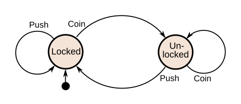

# Finite-State Machine
This is a very basic example of Finite-State Machine


# usage
```bash
❯ ./build.sh && ./fsm_example
+ CC=gcc
+ CFLAGS='-Wall -Wextra'
+ gcc -Wall -Wextra -o fsm_example fsm_example.c
> push
State: Locked
> push
State: Locked
> coin
State: Unlocked
> quit
```
# Resources
- [Wikipedia - Finite-State Machien](https://en.wikipedia.org/wiki/Finite-state_machine)
