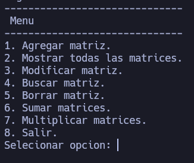

# Suma y multiplicación de matrices 2x2

El programa es un CRUD(crea, lee, actualiza y borra) que toma como base de datos el archivo de texto plano `matrices.txt`. Contiene un menú con las siguientes opciones:



# Ejecutar programa
```bash
chmod +x build.sh
./build.sh && ./matriz
```

# Nota:
- En el programa aun se puede refactorizar, hacer mejores como la sobrecarga de las funciones de suma y multiplicación. 
- También podemos agregar nuevas caracteristicas, como la suma de matrices de cualquier dimensión.

Si usted desea que mejore el programa, sientase libre de contactarme para poder hacer las mejoras.
